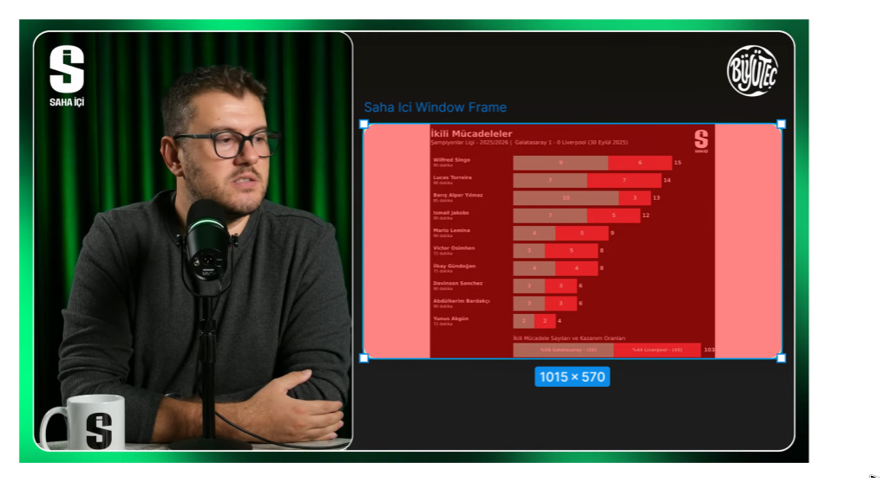

# Data Visualization

The problem with using plain python data viz libraries was that they are designed for pre-made charts. For the case of mediatic data visualization, these are not a great tool due to the limitations of the customized layer design.

I have tried to implement several different layouts, but each time it is quite hard to replace something or make an edit. Just the basic operation of adding an additional player to the duels chart was a hustle that I could not pull off without spending a lot of hours.

This gave me some headaches, and I decided to find a solution that is helpful for both custom designs for aesthetics and also for data visualization.

### My Solution:

I decided to test with .svg files; I think they are a great fit. I can design custom layouts in figma, and then use the elements in the svg to adjust widths, colors, dynamic texts, etc. with python.

from now on, I will be documenting the process of development.

---

# Day1 - October 1st, 2025:

### Determining the Aspect Ratio for Visuals: 
 

I collected a frame from the YT channel, then determined the aspect ratio that I will be working with. As you can see, previous design does not handle this and it has an unwanted view.

The ratio I will be working with is: 1015x570

### Playing with .svg Files

